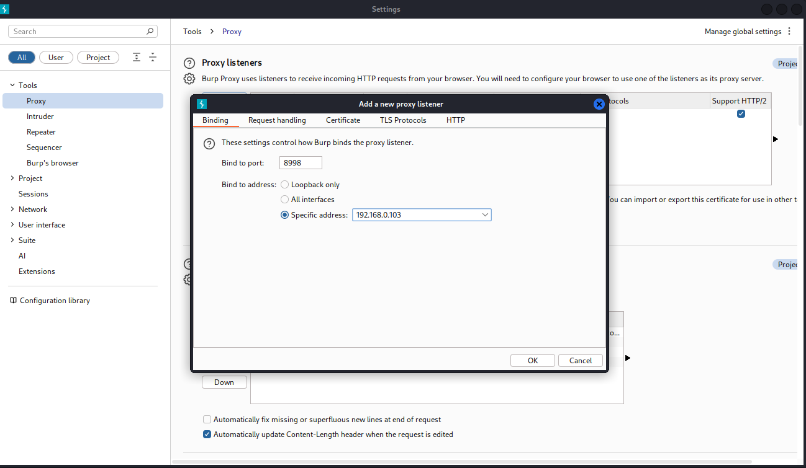
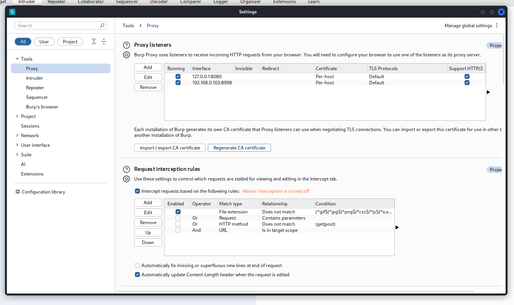
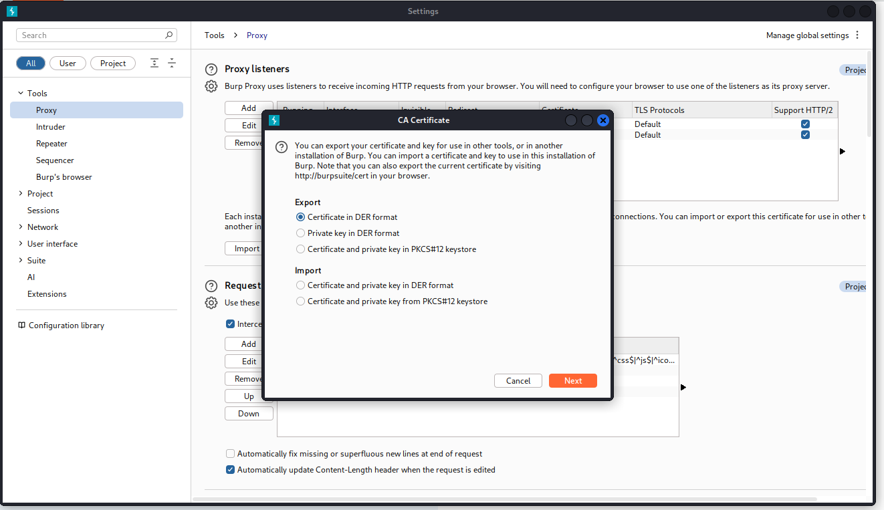
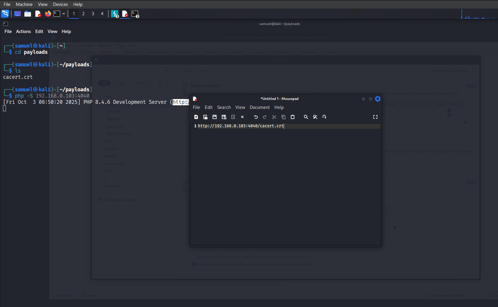
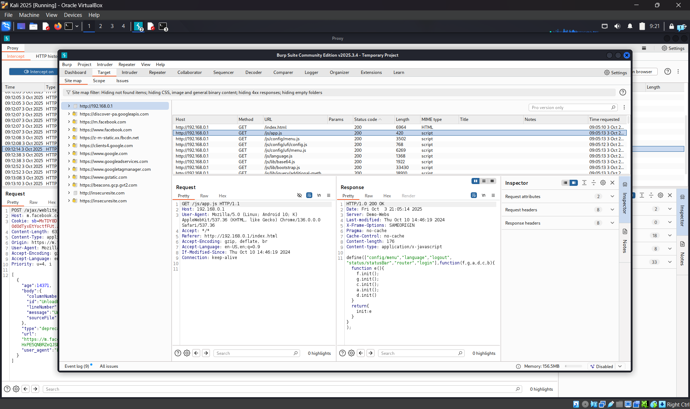

# MITM (Man-in-the-Middle) Lab Debrief

**Test context:** Controlled lab environment — reverse proxy MITM using Burp Suite.  
**Note:** All testing was performed in a safe environment and i was practically both attacker and the target. However the methodologies learnt in this article should not be used for malicious attacks.

---

## 1) Quick debrief — what I actually did
- I stood a **reverse proxy** between client and server (Burp acting as man‑in‑the‑middle).
- Target's traffic was routed through Burp (proxy config / transparent proxy).
- Burp intercepted HTTP(s) traffic:
  - Presented Burp’s CA cert to the target and the client target it (lab),
- I inspected, modified, or replayed requests/responses and observed the effect.

#### Quick set up:
- **Setting up a proxy listener**:

  
  As you can see here in this image, i  created a proxy listener and binded it to port 8998 and ip address 192.168.0.103 note in your own case your ip might be different depending on your network setup.

- **Generating CA certificate**

  Burp-generated CA certificate is simply a private root CA (certificate + private key) that Burp creates locally.
Burp acts as a local TLS proxy: the Burp CA signs TLS certificates on the fly for whatever host your target tries to reach, so the target thinks it’s talking to the real server over HTTPS while Burp decrypts the traffic and then forwards it to the real server.

  

  It enables Burp to perform a man-in-the-middle (MITM) for debugging/analysis of HTTPS traffic.

- **Export certificate**

  

  Export in what ever format that best suits your need, in my own case I exported in DER format.

- **Saving file**

  You can choose any name to save your certificate as but the extension has to be `.crt`, though in your case your target may require different extension. Whichever way it's fine.

- **Quick Tip**

  How do you trick your target into downloading the certificate, or how do you even setup the proxy on their device?. This is where your social engineering skills come to play. I don't have a specific target that is to say i am both the attacker and the target, which i'm also guessing you are too.

  To get my target to download the certificate, i hosted the payload on the network so that everyone in my network gets access to it, then i sent the generate url to the target sych that when he/she visits the url the certificate automatically downloads.

  

  With that been said and done, now your target should have it downladed then I leave you to figure out how to setup the proxy and the certificate on your target's device.

  With everything setup currently, try to visit and search anything on your target's web browser, or wait patiently for him/her to do anything. you should see something like this:

  

  ***BOOM attack carried out successfully ✅***

  **Note:** for safe practices and ethical reasons, i decided to skip some steps go on and figure it out (that's a challenge though).
---

## 2) Evidence to collect
I'm presuming you are using this methodoligies for a good reason and to test your skills, however building report after a successful pentesting is a good thing though. 
Preserve the following artifacts for analysis and reporting:
- Burp **HTTP history** / request-response pairs (export the project).
- Screenshots of intercepted flows showing credentials or tokens.
- PCAP of the network traffic (tcpdump/wireshark) while reproducing the attack.
- Burp project file (`.burp`) and exported logs (CSV/JSON).
- Exact Burp settings (proxy listener, CA used, match/replace rules, macros).
- Time stamps, target IPs/URLs, and the exact test steps performed.

**Quick export from Burp:**
- `Proxy → HTTP history`: select all → right click → **Save items** → XML/CSV.
- Or `Project → Save project` for `.burp`.

**Capture PCAP:**
```bash
sudo tcpdump -i eth0 host <target_ip> -w mitm_capture.pcap
```

---

## 3) Quick analysis checklist — what to look for
- **Authentication credentials** in POST bodies or `Authorization: Basic ...` headers.
- **Session cookies** and whether they include `HttpOnly`, `Secure`, `SameSite`.
- **Bearer tokens / JWTs** in `Authorization: Bearer <token>` headers — decode with jwt.io offline.
- **CSRF tokens** — presence and reuse.
- **Sensitive data in URLs** (GET querystrings).
- **Insecure cookies**: missing `Secure`/`HttpOnly`.
- **Mixed content**: HTTPS pages loading HTTP resources.
- **Certificate issues**: client accepted a non-original CA or pinning bypass.

**Search examples / tools**
- Use regex to find tokens and credentials in exported HTTP history.
- Use `tshark` to extract HTTP fields:
```bash
tshark -r mitm_capture.pcap -Y 'http.request or http.response' -T fields -e ip.src -e http.host -e http.request.uri -e http.file_data
```

---

## 4) Demonstrations you can perform
- Replay captured login with credentials to show access (Burp Repeater or `curl`).
- Tamper with a POST parameter (e.g., `transfer_amount`) and show server response.
- Demonstrate session fixation by setting a session cookie and authenticating.
- Replay a bearer token to show session reuse.

**Example replay with curl:**
```bash
curl -v -H "Authorization: Bearer <token>" https://target.example/protected
```

---


## 5) Recommended mitigations & why they help
- **Enforce TLS everywhere**: use HTTPS, HSTS (`includeSubDomains`, long `max-age`), and consider HSTS preloading.  
- **Validate certificates & pinning**: certificate pinning for sensitive clients (mobile/native) and check OCSP/CRL.  
- **Secure cookies**: `Secure`, `HttpOnly`, appropriate `SameSite`.  
- **Token best practices**: short‑lived access tokens, rotate refresh tokens, bind tokens to client/context.  
- **Avoid credentials in GET**: use POST and headers for sensitive data.  
- **Mutual TLS** for critical services to make MITM harder.  
- **Detect anomalies**: TLS fingerprinting, monitor cert chain changes, detect token reuse across IPs/devices.  
- **User education**: avoid installing unknown CA certs and follow security guidance.

---

## 6) Detection ideas (for defenders)
- Monitor for many different IPs reusing the same session token.
- Alert on self‑signed or unusual certificate chains to servers.
- Use JA3/JA3S TLS fingerprinting to spot proxying or altered TLS stacks.
- IDS rules to detect HTTP cleartext tokens or abnormal User-Agent/TLS changes.

---

## Disclaimer
The methodologies as i have rightly said earlier should be used for educational purposes only and i will not be held responsible for any harm caused.